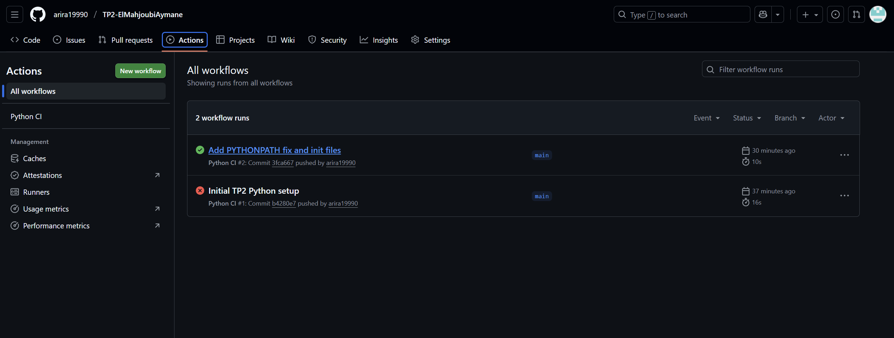

# TP2 -- GitHub Actions (Python)

**Nom :** ElMahjoubi Aymane\
**Dépôt GitHub :** TP2-ElMahjoubiAymane

------------------------------------------------------------------------

## 🎯 Objectif du TP

L'objectif de ce TP est de configurer un système d'intégration continue
(CI) à l'aide de GitHub Actions pour un projet Python simple.

Le TP consiste à : - créer un dépôt GitHub respectant les consignes, -
assurer que le projet Python fonctionne sans erreur, - configurer un
workflow GitHub Actions, - exécuter automatiquement les tests
unitaires, - ajouter des captures d'écran dans le README, - rédiger un
petit rapport sur le travail effectué.

------------------------------------------------------------------------

## 📁 Structure du projet

Voici l'organisation du projet :

    TP2-ElMahjoubiAymane/
    ├── app.py
    ├── __init__.py
    ├── requirements.txt
    ├── README.md
    ├── rapport_TP2.md
    │
    ├── captures/
    │   └── workflow.png
    │
    ├── tests/
    │   ├── test_app.py
    │   └── __init__.py
    │
    └── .github/
        └── workflows/
            └── python-ci.yml

------------------------------------------------------------------------

## ⚙️ Workflow GitHub Actions

Le workflow suivant permet d'exécuter automatiquement les tests
unitaires à chaque **push** ou **pull request** sur la branche `main`.

``` yaml
name: Python CI

on:
  push:
    branches: [ "main" ]
  pull_request:
    branches: [ "main" ]

jobs:
  build:
    runs-on: ubuntu-latest

    steps:
      - uses: actions/checkout@v3

      - name: Set up Python
        uses: actions/setup-python@v4
        with:
          python-version: "3.10"

      - name: Install dependencies
        run: |
          pip install -r requirements.txt

      - name: Add project root to PYTHONPATH
        run: echo "PYTHONPATH=$GITHUB_WORKSPACE" >> $GITHUB_ENV

      - name: Run tests
        run: pytest
```

------------------------------------------------------------------------

## 🧪 Tests unitaires

Les tests unitaires permettent de vérifier automatiquement le bon
fonctionnement du projet.

Exemple de test situé dans `tests/test_app.py` :

``` python
from app import add

def test_add():
    assert add(2, 2) == 4
```

------------------------------------------------------------------------

## 📸 Captures d'écran

### ✔️ Workflow GitHub Actions réussi



------------------------------------------------------------------------

## 📑 Rapport du TP

Le rapport détaillé est disponible dans :\
👉 **rapport_TP2.pdf**

------------------------------------------------------------------------

## ✅ Conclusion

Ce TP m'a permis de : - mettre en place un workflow CI complet et
fonctionnel, - automatiser les tests unitaires Python avec GitHub
Actions, - comprendre le fonctionnement de l'intégration continue, -
corriger une erreur de test et valider la fiabilité du pipeline, -
structurer un projet Python proprement.

L'ensemble des consignes du TP a été respecté et le workflow s'exécute
correctement.
